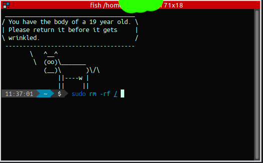
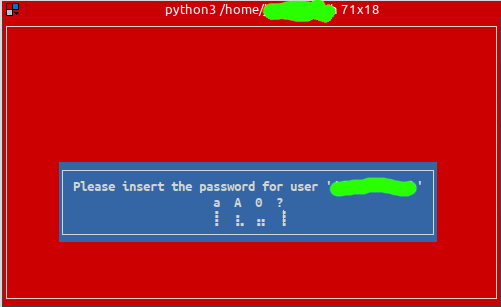

# Unnamed Curser Password Prompt

___If you are here, you're probably like myself: a bit of paranoiac.___

When you have lengthy passwords, especially when your password mix upper and lower case letters,
numbers and special characters, typing fast may cause one of your Shift to be missed. This is
something that the traditional `*` style password prompt don't help. And hey, we're paranoiac,
we don't want to share how many characters our password have, right?

So what would be even better is to have a visual feedback of upper/lower case, numbers and
special symbols when we're typing, but not something that reveals how many of those. At max
its number modulo.

So, this is why I made this. Each animation changes every time you type a character for that
type.

_Suppose you want to run the command:_



_You will then be prompted:_



## Installation and Setup

Download the file, read it, make sure the code makes sense and there is no Trojan or
any vulnerability risk. Then put wherever you feel comfortable with, for example
`~/bin/curser_pass_prompt.py`.

Set its permissions:
```
$ chmod 500 ~/bin/curser_pass_prompt.py
# Optional, prevent file from changes, except from root users
$ sudo chattr +i ~/bin/curser_pass_prompt.py
```

..and change your alias for your sudo command:

__BASH__ [~/.bash_profile]

```
alias sudo="sudo -A"
export SUDO_ASKPASS="~/bin/curser_pass_prompt.py"
```

__ZSH__ [~/.zshrc]

```
alias sudo="sudo -A"
typeset +x SUDO_ASKPASS="~/bin/curser_pass_prompt.py"
```

__FISH__ [~/.config/fish/config.fish]
```
set -x SUDO_ASKPASS ~/bin/curser_pass_prompt.py
alias sudo 'sudo -A'
```
